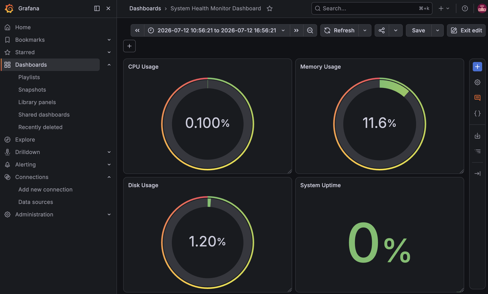

# System Health Monitor / システム健全性監視

A Python system monitoring project that tracks CPU, memory, disk usage, and uptime. It includes threshold-based alerts, Slack/email notifications, alert cooldowns, recovery alerts, structured logging, a FastAPI `/health` endpoint, Docker healthchecks, and GitHub Actions CI/CD validation.

CPU、メモリ、ディスク使用量、稼働時間を監視する Python プロジェクトです。しきい値ベースのアラート、Slack/メール通知、アラートクールダウン、回復アラート、構造化ログ、FastAPI `/health` エンドポイント、Docker ヘルスチェック、GitHub Actions CI/CD 検証を含みます。

## Screenshots

### Terminal Monitor


### Grafana Dashboard



## Current Status / 現在のステータス

| Feature | Status |
| --- | --- |
| CPU, memory, disk, and uptime monitoring | ✅ Complete |
| Warning and critical threshold detection | ✅ Complete |
| Slack and email alerts | ✅ Complete |
| Alert cooldowns and recovery alerts | ✅ Complete |
| Structured logging | ✅ Complete |
| FastAPI `/health` endpoint | ✅ Complete |
| Docker container support | ✅ Complete |
| Docker healthcheck | ✅ Complete |
| Prometheus `/metrics` endpoint | ✅ Complete |
| Prometheus scrape configuration | ✅ Complete |
| Grafana service with persistent volume | ✅ Complete |
| Grafana dashboard panels | ✅ Complete |
| GitHub Actions CI/CD health endpoint check | ✅ Complete |
| EN/JP comments for learning and review | ✅ Complete |

## Features / 機能

- Terminal-based system monitoring
- CPU, memory, disk, and uptime checks
- Configurable warning and critical thresholds
- Slack and email alert support
- Cooldown logic to prevent repeated alerts
- Recovery alerts when metrics return to OK
- Structured logs in `logs/system_health.log`
- Readable health logs in `logs/health_log.txt`
- FastAPI `/health` endpoint
- Prometheus-compatible `/metrics` endpoint
- Prometheus scrape configuration with Docker Compose
- Grafana service connected to Prometheus
- Basic Grafana dashboard for CPU, memory, disk, and uptime
- Docker Compose support
- GitHub Actions CI/CD pipeline

## Health API

Run the FastAPI health API:

```bash
python3 -m uvicorn health_api:app --reload --port 8000
```

Check the health endpoint:

```bash
curl http://127.0.0.1:8000/health
```

Local URLs:

| Page | URL |
| --- | --- |
| API Root | http://localhost:8000 |
| Health Endpoint | http://localhost:8000/health |
| Swagger UI | http://localhost:8000/docs |

## Docker Usage

Build and run:

```bash
docker compose up --build
```

Run in the background:

```bash
docker compose up -d
```

Check the health endpoint:

```bash
curl http://127.0.0.1:8000/health
```

Stop the container:

```bash
docker compose down
```
## Monitoring Stack

This project includes a Docker Compose monitoring stack with:

- FastAPI `/health` endpoint
- Prometheus `/metrics` endpoint
- Prometheus scrape configuration
- Grafana dashboard panels for CPU, memory, disk, and uptime

Full monitoring documentation is available here:

[Monitoring Stack Documentation](./docs/monitoring-stack.md)

## CI/CD

A Python system monitoring project that tracks CPU, memory, disk usage, and uptime. It includes structured logging, Slack/email alerts, alert cooldowns, recovery alerts, a FastAPI `/health` endpoint, Prometheus `/metrics` endpoint, Docker healthchecks, Prometheus scraping, Grafana dashboard panels, and GitHub Actions CI/CD validation.

Current pipeline:

- Install Python dependencies
- Validate Python syntax
- Check key module imports
- Run tests when available
- Build Docker image
- Start Docker container
- Call the FastAPI `/health` endpoint
- Fail if the health endpoint does not respond

## Installation

Clone the repository:

```bash
git clone https://github.com/Iris408/system-health-monitor.git
cd system-health-monitor
```

Install dependencies:

```bash
pip install -r requirements.txt
```

Run the terminal monitor:

```bash
python3 main.py
```

Run the FastAPI health API:

```bash
python3 -m uvicorn health_api:app --reload --port 8000
```

## Tech Stack

- Python
- FastAPI
- Docker
- Docker Compose
- GitHub Actions
- psutil
- colorama
- python-dotenv
- requests
- Slack Webhooks
- SMTP Email

## Additional Documentation

More detailed project documentation is available in the `docs/` folder.

| Document | Description |
| --- | --- |
| [Monitoring Stack](./docs/monitoring-stack.md) | Prometheus, Grafana, Docker Compose, and metrics setup |
| [Project Details](./docs/project-details.md) | Environment variables, logs, learning notes, and development notes |

## Author

Built by Iris408